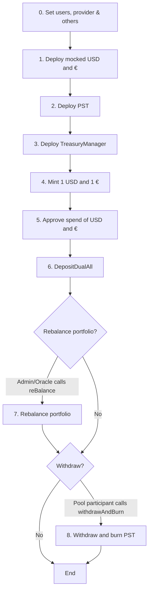
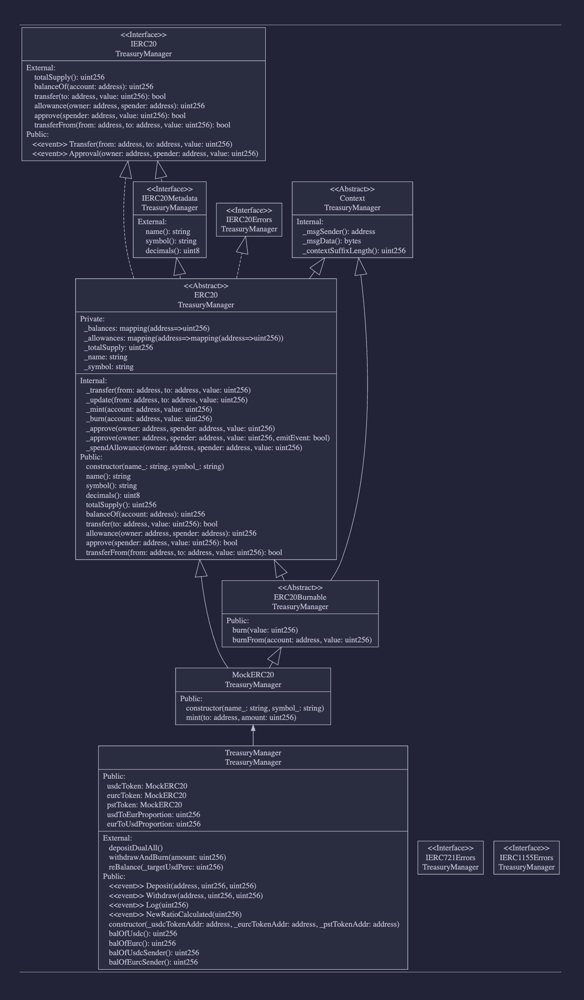

# Kalshi Oracle and Treasury Auto Balancer

**Live demo:**

Check out the live demo [here](https://trade.delphi-pool.com/).


*"Predictive Treasury Automation"*

**The Problem:** Traditional stablecoin portfolio management relies on outdated price data and manual intervention, leaving institutions exposed to volatile foreign exchange risks and suboptimal capital allocation.

**Our Solution:** We've built the first-ever prediction market oracle that transforms Kalshi's real-time odds into actionable smart contracts, automatically rebalancing USDC/EURC portfolios based on forward-looking market expectations rather than historical prices.

**The Innovation:**

* ⁠Real-time USD/EUR outlook signals published directly to Arc Network

* ⁠Smart contracts trigger automated rebalancing based on prediction market insights

* ⁠First-of-its-kind integration of prediction markets with DeFi primitives

* Allows multiple people to participate in the treasury and each participant will receive an allocation of **PST** (**Pool Share Token**) proportional to their contribution and at the same time your PST will remain the same despite the re-balancing (you will be able to withdraw at any time and you will receive the optimum balance that will maintain your purchasing power).

**The Opportunity:**
Institutional treasuries, DAOs, and digital custodians need automated currency allocation that aligns with verified market expectations. Our solution provides:

* ⁠Automated stablecoin reserve management
* ⁠Enhanced FX risk mitigation
* ⁠Rules-based portfolio rebalancing powered by predictive analytics

**Why Now:** The convergence of prediction markets, DeFi infrastructure, and institutional crypto adoption creates a massive opportunity to revolutionize how digital assets are managed across the enterprise ecosystem.

**The Goal:** Build upon our oracle foundation to create new use cases for predictive finance in decentralized treasury management.


We are ready to build the future of automated stablecoin portfolio management.

---

## Technical Explanation

At the core of this project there's the **TreasuryManager** smart contract. Connected to the treasury we have 3 tokens ( 1 mocked **wrapped USDC**, 1 mocked **EURC** and **Pool Share Token aka PST** ). Lastly we have the **KalshiLinkOracle** smart contract.

The normal flow is the following:

`0.` Set users, provider & others; `1.` Depl mocked USD; `2.` Depl mocked €; `3.` Depl PST; `4.` Depl TrezMgr; `5.` Mint 1USD; `6.` Mint 1€; `7.` ApproveSpendOfUSD; `8.` ApproveSpendOf€; `9.` DepositDualAll ( deposit USDC and € simultaneously and get Pool Share Tokens in proportion to how much you've deposited );

After that if the Admin wants to `10.` rebalance the portfolio to have, let's say, instead of 1 USD and 1 € it can do that by calling the reBalance function ( this also allows for the KalshiLinkOracle to do the same reBalancing automatically ). Finally the pool participant can withdraw `11.` his portion of the pie by burning his/her PST token(s) using the withdrawAndBurn function.



For more details on how the first main contract (treasury) and second smart contract (oracle) works, see below.

---

## Kalshi Oracle
A FastAPI server polls the Kalshi prediction market API and determines the odds of the direction of EUR/USD FX rates. It records this on Arc through the **KalshiLinkOracle** smart contract. Based on the odds, it autonomously calculates the adjustment needed to rebalance the pool.


## Installation

Install with:

```sh
npm i
```

Copy over the .env.example end edit it

```sh
cp .env.example .env
```

Compile:

```sh
npm run compile
```

---

## Backend

Create the Python env variable

```sh
source venv/bin/activate
```

And then run the backend:

```sh
python main.py
```

---

## Diagram



---

## TreasuryManager Smart Contract Documentation

### Contract
TreasuryManager : arc/TreasuryManager.sol

 ---
### Functions:
### constructor

```solidity
constructor(address _usdcTokenAddr, address _eurcTokenAddr, address _pstTokenAddr) public
```

### depositDualAll

```solidity
function depositDualAll() external
```

### withdrawAndBurn

```solidity
function withdrawAndBurn(uint256 amount) external
```

### reBalance

```solidity
function reBalance(uint256 _targetUsdPerc) external
```

### balOfUsdc

```solidity
function balOfUsdc() public view returns (uint256)
```

### balOfEurc

```solidity
function balOfEurc() public view returns (uint256)
```

### balOfUsdcSender

```solidity
function balOfUsdcSender() public view returns (uint256)
```

### balOfEurcSender

```solidity
function balOfEurcSender() public view returns (uint256)
```

 --- 
### Events:
### Deposit

```solidity
event Deposit(address, uint256, uint256)
```

### Withdraw

```solidity
event Withdraw(address, uint256, uint256)
```

### Log

```solidity
event Log(uint256)
```

### NewRatioCalculated

```solidity
event NewRatioCalculated(uint256)
```

## MockERC20 Smart Contract Documentation

### Contract

MockERC20 : arc/MockERC20.sol

 ---
### Functions:
### constructor

```solidity
constructor(string name_, string symbol_) public
```

### mint

```solidity
function mint(address to, uint256 amount) public
```

inherits ERC20Burnable:
### burn

```solidity
function burn(uint256 value) public virtual
```

_Destroys a `value` amount of tokens from the caller.

See {ERC20-_burn}._

### burnFrom

```solidity
function burnFrom(address account, uint256 value) public virtual
```

_Destroys a `value` amount of tokens from `account`, deducting from
the caller's allowance.

See {ERC20-_burn} and {ERC20-allowance}.

Requirements:

- the caller must have allowance for ``accounts``'s tokens of at least
`value`._

inherits ERC20:
### name

```solidity
function name() public view virtual returns (string)
```

_Returns the name of the token._

### symbol

```solidity
function symbol() public view virtual returns (string)
```

_Returns the symbol of the token, usually a shorter version of the
name._

### decimals

```solidity
function decimals() public view virtual returns (uint8)
```

_Returns the number of decimals used to get its user representation.
For example, if `decimals` equals `2`, a balance of `505` tokens should
be displayed to a user as `5.05` (`505 / 10 ** 2`).

Tokens usually opt for a value of 18, imitating the relationship between
Ether and Wei. This is the default value returned by this function, unless
it's overridden.

NOTE: This information is only used for _display_ purposes: it in
no way affects any of the arithmetic of the contract, including
{IERC20-balanceOf} and {IERC20-transfer}._

### totalSupply

```solidity
function totalSupply() public view virtual returns (uint256)
```

_Returns the value of tokens in existence._

### balanceOf

```solidity
function balanceOf(address account) public view virtual returns (uint256)
```

_Returns the value of tokens owned by `account`._

### transfer

```solidity
function transfer(address to, uint256 value) public virtual returns (bool)
```

_See {IERC20-transfer}.

Requirements:

- `to` cannot be the zero address.
- the caller must have a balance of at least `value`._

### allowance

```solidity
function allowance(address owner, address spender) public view virtual returns (uint256)
```

_Returns the remaining number of tokens that `spender` will be
allowed to spend on behalf of `owner` through {transferFrom}. This is
zero by default.

This value changes when {approve} or {transferFrom} are called._

### approve

```solidity
function approve(address spender, uint256 value) public virtual returns (bool)
```

_See {IERC20-approve}.

NOTE: If `value` is the maximum `uint256`, the allowance is not updated on
`transferFrom`. This is semantically equivalent to an infinite approval.

Requirements:

- `spender` cannot be the zero address._

### transferFrom

```solidity
function transferFrom(address from, address to, uint256 value) public virtual returns (bool)
```

_See {IERC20-transferFrom}.

Skips emitting an {Approval} event indicating an allowance update. This is not
required by the ERC. See {xref-ERC20-_approve-address-address-uint256-bool-}[_approve].

NOTE: Does not update the allowance if the current allowance
is the maximum `uint256`.

Requirements:

- `from` and `to` cannot be the zero address.
- `from` must have a balance of at least `value`.
- the caller must have allowance for ``from``'s tokens of at least
`value`._

### Events:
inherits ERC20Burnable:
inherits ERC20:
inherits IERC20Errors:
inherits IERC20Metadata:
inherits IERC20:
### Transfer

```solidity
event Transfer(address from, address to, uint256 value)
```

_Emitted when `value` tokens are moved from one account (`from`) to
another (`to`).

Note that `value` may be zero._

### Approval

```solidity
event Approval(address owner, address spender, uint256 value)
```

_Emitted when the allowance of a `spender` for an `owner` is set by
a call to {approve}. `value` is the new allowance._

---

## KalshiLinkOracle Smart Contract Documentation

### Contract
KalshiLinkOracle : arc/KalshiLinkOracle.sol

 --- 
### Functions:
### constructor

```solidity
constructor(address initialOwner) public
```

### fulfillPredictionMarketDataEurUsd

```solidity
function fulfillPredictionMarketDataEurUsd(uint256 _value, uint256 _timestamp, uint256 _resolutionTimestamp) external
```

### getDataPoint

```solidity
function getDataPoint(uint256 _index) public view returns (struct KalshiLinkOracle.DataPoint)
```

### getName

```solidity
function getName() public view returns (string)
```

inherits Ownable:
### owner

```solidity
function owner() public view virtual returns (address)
```

_Returns the address of the current owner._

### renounceOwnership

```solidity
function renounceOwnership() public virtual
```

_Leaves the contract without owner. It will not be possible to call
`onlyOwner` functions. Can only be called by the current owner.

NOTE: Renouncing ownership will leave the contract without an owner,
thereby disabling any functionality that is only available to the owner._

### transferOwnership

```solidity
function transferOwnership(address newOwner) public virtual
```

_Transfers ownership of the contract to a new account (`newOwner`).
Can only be called by the current owner._

 --- 
### Events:
inherits Ownable:
### OwnershipTransferred

```solidity
event OwnershipTransferred(address previousOwner, address newOwner)
```
